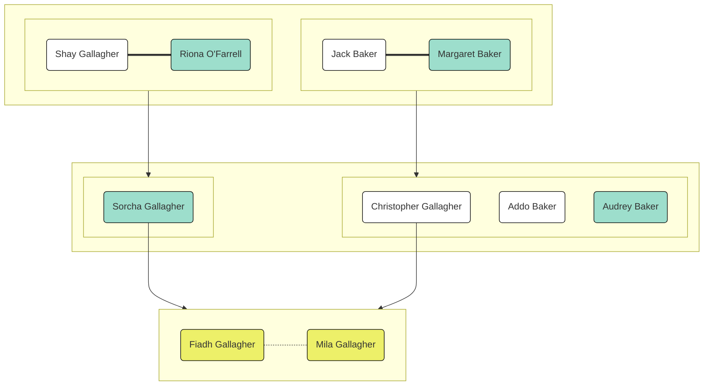

# Fiadh and Mila's Family

```mermaid
flowchart
	style MGrandfather fill:#fff, stroke:#000
	style MGrandmother fill:#9ddecc,stroke:#000
	style PGrandfather fill:#fff, stroke:#000
	style PGrandmother fill:#9ddecc,stroke:#000
	style Mother fill:#9ddecc, stroke:#000
	style Father fill:#fff, stroke:#000
	style PUncle1 fill:#fff, stroke:#000
	style PAunty1 fill:#9ddecc, stroke:#000
	style Child1 fill:#edf069, stroke:#000
	style Child2 fill:#edf069, stroke:#000

	class MGrandfather internal-link;
	class MGrandmother internal-link;
	class Mother internal-link;
	class Father internal-link;
	class PGrandfather internal-link;
	class PGrandmother internal-link;
	class Child1 internal-link;
	class Child2 internal-link;

	subgraph Grandparents[ ]
		subgraph GrandparentsM[ ]
			direction LR
			MGrandfather(Shay Gallagher) === MGrandmother(Riona O'Farrell)
		end
	
		
		subgraph GrandparentsP[ ]
			direction LR
			PGrandfather(Jack Baker) === PGrandmother(Margaret Baker)
		end
	end

	subgraph MumSide[ ]
		Mother(Sorcha Gallagher)
	end

	subgraph DadSide[ ]
		direction LR
		Father(Christopher Gallagher)
		PUncle1("Addo Baker")
		PAunty1("Audrey Baker")
	end
	
	subgraph Parents[ ]
		direction LR
		MumSide & DadSide
	end

	subgraph Children[ ]
		direction LR
		Child1(Fiadh Gallagher) -.- Child2(Mila Gallagher)
	end

	GrandparentsP ---> DadSide
	GrandparentsM ---> MumSide
	Mother(Sorcha Gallagher) & Father(Christopher Gallagher) ---> Children

```
