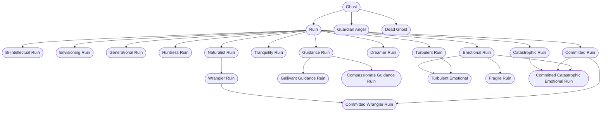

```mermaid
graph TD;
    ghost(["Ghost"])-->ruin(["Ruin"]);
    ghost(["Ghost"])-->Angel(["Guardian Angel" ]);
    ghost(["Ghost"])-->dGhost(["Dead Ghost"]);
    
    ruin-->ruinIntel(["Bi-Intellectual Ruin"]);
    ruin-->ruinEnvis(["Envisioning Ruin"]);
    ruin-->ruinGenerational(["Generational Ruin"]);
    ruin-->ruinHuntress(["Huntress Ruin"]);
    ruin-->ruinNaturalist(["Naturalist Ruin"]);
    ruin-->ruinTranquil(["Tranquility Ruin"]);
    ruin-->ruinGuidance(["Guidance Ruin"]);
    ruin-->ruinDreamer(["Dreamer Ruin"]);
    ruin-->ruinCommitted(["Committed Ruin"]);
    ruinNaturalist-->ruinWrangler(["Wrangler Ruin"]);
    ruinWrangler-->ruinCWrangler(["Committed Wrangler Ruin"]);
    ruinCommitted-->ruinCWrangler;
    ruinGuidance-->ruinGuidance1(["Gallivant Guidance Ruin"]);
    ruinGuidance-->ruinGuidance2(["Compassionate Guidance Ruin"]);
    ruin-->ruinEmotional(["Emotional Ruin"]);
    ruin-->ruinTurbulent(["Turbulent Ruin"]);
    ruinEmotional-->ruinTEmotional(["Turbulent Emotional"]);
    ruinTurbulent-->ruinTEmotional
    ruinEmotional-->ruinFragile(["Fragile Ruin"]);
    ruin-->ruinCatastrophic(["Catastrophic Ruin"]);
    ruinCatastrophic-->ruinCCEmotional(["Committed Catastrophic Emotional Ruin"]);
    ruinCommitted-->ruinCCEmotional
    ruinEmotional-->ruinCCEmotional
```
