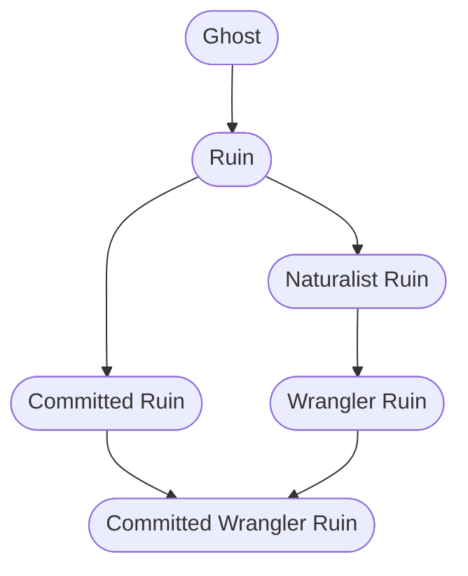

#ruin 

```mermaid
graph TD;
ghost(["Ghost"])-->ruin(["Ruin"])
ruin-->ruinCommitted(["Committed Ruin"])
ruin-->ruinNaturalist(["Naturalist Ruin"])
ruinNaturalist-->ruinWrangler(["Wrangler Ruin"])
ruinCommitted-->ruinCWrangler(["Committed Wrangler Ruin"])
ruinWrangler-->ruinCWrangler
```
- A Ruin who can communicate very well with animals, but whose will to do so is strong enough to prevent them from moving to the Afterlife upon death.
