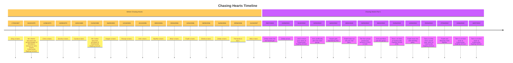

```mermaid
---
title: "Chasing Hearts Timeline"
config:
  theme: base
  themeVariables:
    fontSize: "20px"
---

timeline
    title Chasing Hearts Timeline
	section Before Chasing Hearts
		17/03/1937:
			Shay is born.
		01/02/1970:
			Mrs Martin becomes the second leader of Sheridan’s School for Girls (future Kalamunda Sapling School).
		12/06/1970:
			Chris is born.
		03/09/1970:
			Sorcha is born.
		13/02/1989:
			Gunda is born.
		01/02/1990:
			Ms Cortez becomes principal of Kalamunda Sapling School.
		06/09/2005:
			Harper is born.
		10/18/2005:
			Roosje is born.
		25/12/2005:
			Ash is born.
		08/02/2006:
			Myrthe is born.
		05/04/2006:
			Altair is born.
		12/04/2006:
			Fiadh is born.
		08/05/2006:
			Sheila is born.
		04/06/2006:
			Zelda is born.
		29/06/2006:
			Fernanda is born.
		31/10/2007:
			Mila is born.
	section Chasing Hearts Part 1
		29/07/2020:
			Zelda meets the red-haired girl.
		15/08/2021:
			Zelda arrives 
		01/02/2022:
			2022 school year starts at Kalamunda Sapling School.
		02/02/2022:
			Ash unofficially joins the main group.
		16/02/2022:
			Harper gets rejected by Ash.
		28/02/2022:
			Fiadh finds out who Ms Van likes.
		02/03/2022:
			The first school production session of 2022 is held.
		08/03/2022:
			Ash and Alice join the group.
		01/04/2022:
			Term 1 of 2022 at Kalamunda Sapling School ends.
		12/04/2022:
			Fiadh hosts her 16th birthday party.
		25/04/2022:
			Term 2 of the 2022 school year starts at Kalamunda Sapling School.
		27/04/2022:
			Fiadh and Miranda meet Myrthe.
		24/06/2022:
			Term 2 of 2022 ends at Kalamunda Sapling School.
		18/07/2022:
			Term 3 of 2022 starts at Kalamunda Sapling School.
```
